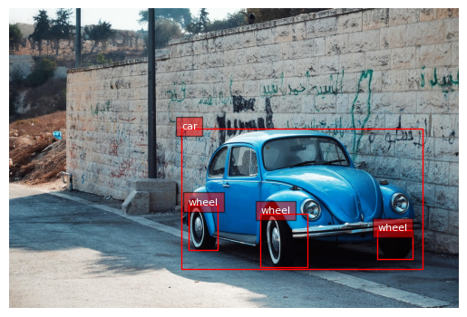

# 🎯 Auto-Labeling Images with Microsoft Florence 2 and Meta AI SAM

Unlock the potential of **Florence 2 & SAM** with this step-by-step guide to **automatically label images** and simplify your AI workflows!

This beginner-friendly project showcases how to leverage Microsoft’s **Florence 2 multimodal model** and Meta AI's **SAM multimodal model** for:
- 🏷️ Automatic data labeling
- 🧠 Object detection
- 🖼️ Image classification
- 🧩 Segmentation

Perfect for **AI beginners** and enthusiasts alike, these two notebooks provides a clear, well-structured approach to mastering modern AI tools like **Hugging Face** and **Google Colab**.

## 🚀 What You’ll Learn

- ✅ Set up and use  Florence 2 and SAM for various vision tasks  
- 🗂️ Process image data and handle prompts  
- 🔍 Auto-generate annotations for models like **YOLOv9**  
- 🔧 Use platforms like **Roboflow** to enhance your pipeline  
- 🧠 Understand the power of multimodal AI
## 🖼️ Auto Object Detection with Florence-2


## 🖼️ Auto Image Segmentation with SAM


## 🛠 Tech Stack

- Python  
- Microsoft Florence 2  
- Hugging Face  
- Google Colab  
- Roboflow  

## 📂 How to Run

```bash
# Clone the repo
git clone https://github.com/TLILIFIRAS/Automatic-Data-Annotation-With-LLMs.git 
cd Automatic-Data-Annotation-With-LLMs

# Set up the environment
pip install -r requirements.txt

# Launch the notebook of Data_Labeling with Florence-2
jupyter notebook Automatic_Data_Labeling_with_Florence_2.ipynb

# Launch the notebook of Data_Labeling for Image Segmentation 
jupyter notebook Automatic_Data_Annotation_for_Image_Segmentation.ipynb
```

Or run it on Google Colab:  

## 📸 Example Use Cases

- 🛠 Preprocessing datasets for object detection with YOLOv9  
- 🧪 Creating labeled datasets for image segmentation  
- ⚙️ Rapid prototyping of AI models without manual annotation  

## 🤝 Contributions & Feedback

Have suggestions or improvements? Feel free to open a pull request or issue. Let’s build smarter AI pipelines together!
